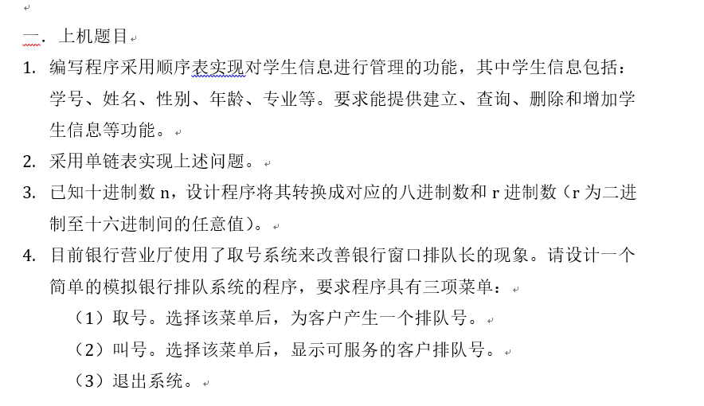

### C++ 题目

**题目**


**解答**
1. Excerse_1.cpp : 学生信息管理系统（顺序表）
2. Excerse_2.cpp : 学习信息管理系统（链表）
3. Excerse_3.cpp : 进制转换（链表实现）
4. Excerse_4.cpp : 银行排队系统

**自动测试**
1. 需要安装docker，[Docker](https//www.docker.com)
2. 进入此项目的根目录
3. 运行如下命令，进行编译
```
docker build -t myapp:1.0 .
```
4. 编译成功后，运行如下命令进行测试
```
docker run -it --rm --name running-app myapp:1.0
```

**手动测试一**
1. 需要安装docker, [Docker](https//www.docker.com)
2. 进入此项目的根目录
3. 运行如下命令
```
docker run -it --rm -v "$PWD":/usr/src/myapp -w /usr/src/myapp gcc:4.9 gcc -o myapp -lstdc++ Exercise_1.cpp
```
- "$PWD" 替换为`本地目录`的`全路径` , 使用 `pwd` 命令获得当前目录
- `-v` 参数把本地的目录映射到容器中：后的目录
- `-w` 为工作目录，生成的myapp会在这个目录中
- gcc:4.9 为在github 上的镜像
- '--rm' 在容器运行后，在文件系统中删除运行的容器

通过这条命令，生成一个在容器中可以执行的文件myapp，由于有映射关系，本地的目录中也同时有这个文件。

4. 运行如下命令，进行测试：
```
docker run -it --rm -v "$PWD":/usr/src/myapp -w /usr/src/myapp  gcc:4.9 ./myapp
``` 

这种测试方式，第三条命令就相当于一个编译的过程，可以在这个过程中测试是否存在编译错误。

5. 第3步和第四步可以整合成一条命令
```
docker run -it --rm -v "$PWD":/usr/src/myapp -w /usr/src/myapp gcc:4.9 sh -c "gcc -o myapp -lstdc++ Exercise_1.cpp ; ./myapp"
```
可以用任何*cpp*文件替换*Exercise_1.cpp*用于测试。 

**手动测试二**
1. 需要安装docker, [Docker](https//www.docker.com)
2. 进入此项目的根目录
3. 运行如下命令
```
docker run -it --rm -v "$PWD":/usr/src/myapp -w /usr/src/myapp gcc:4.9 /bin/sh
```
会进入容器的一个Shell界面, 可以执行容器内的任何命令
同时通过目录映射，把在本地工作目录映射到容器内的工作目录。任何在本地目录的修改，也会在容器内发生同样的修改。
在需要比较多的执行命令的情况下，这种方式也提供了一定的便利性。
